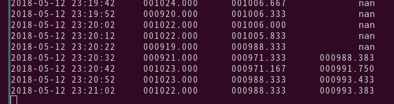
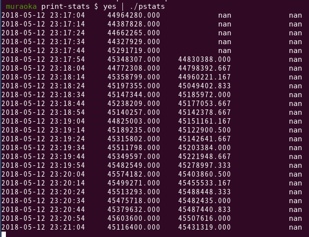

# Print statistics

`pstats` is an application to examine output speed statistics, such as log files.

# Build
`cd print-stats && make`

# Requirements
* C++ Compiler which supports C++11 or above

# How to use
```
$ tail -f hoge.log | ./pstats
```

Output example.
```
 muraoka print-stats $ yes | ./pstats 
2018-05-12 23:30:15	47849800.000	         nan	         nan
2018-05-12 23:30:25	47725617.000	         nan	         nan
2018-05-12 23:30:35	47272022.000	         nan	         nan
2018-05-12 23:30:45	47607745.000	         nan	         nan
2018-05-12 23:30:55	45940802.000	         nan	         nan
2018-05-12 23:31:05	46725093.000	47186846.500	         nan
2018-05-12 23:31:15	47135023.000	47067717.000	         nan
2018-05-12 23:31:25	47865530.000	47091035.833	         nan
2018-05-12 23:31:35	47291325.000	47094253.000	         nan
2018-05-12 23:31:45	47547375.000	47084191.333	         nan
2018-05-12 23:31:55	47794465.000	47393135.167	         nan
```

Columns are from the left, date, the number of output row for 10 seconds, for 1 minute, for 10 minutes.




